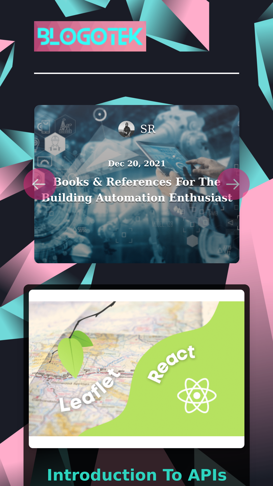
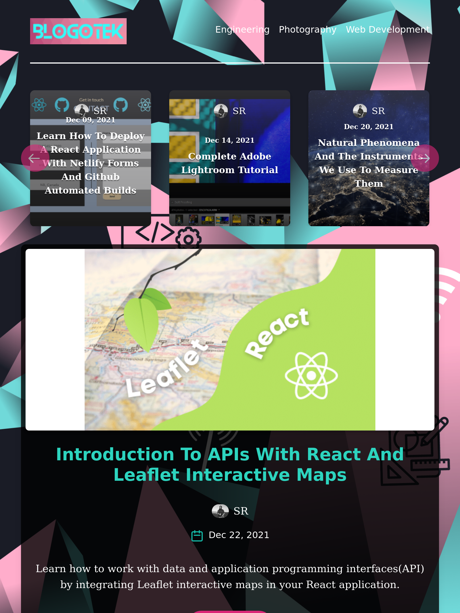
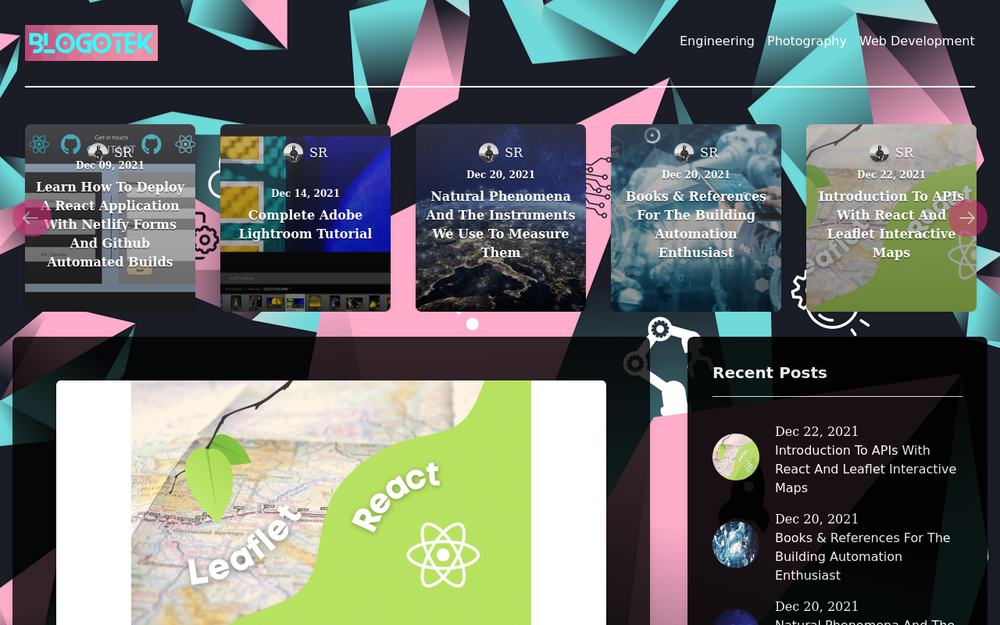

# BLOGOTEK
Fully Responsive, headless CMS blog focused on technology.

<a class="README-link" href="https://blogotek.vercel.app/">Live Demo</a>

<h3>Technologies:</h3>
 <ul>
    <li>REACT</li>
    <li>NextJS</li>
    <li>GraphQL</li>
    <li>GraphCMS</li>
    <li>TailwindCSS</li>
 </ul>

## Preview:

<h3>Init App:</h3>

npx create-next-app -e with-tailwindcss ./

<h3>Dependencies:</h3>
<h4>npm install</h4>
<ul>
  <li>react</li>
  <li>react-dom</li>
  <li>graphql</li>
  <li>graphql-request</li>
  <li>html-react-parser</li>
  <li>moment</li>
  <li>react-multi-carousel</li>
  <li>sass</li>
</ul>

<h3>Run App:</h3>

npm run dev

<h3>Learned:</h3>
<ul>
  <li>Advanced React and Next,js best practices.</li>
  <li>NextJS pre-rendering with static-generation.</li>
  <li>How to create schemas, models and retrieve data using GraphQL queries.</li>
  <li>How to create data in GraphCMS.</li>
  <li>How to create a modern UI using TailwindCSS</li>
</ul>
